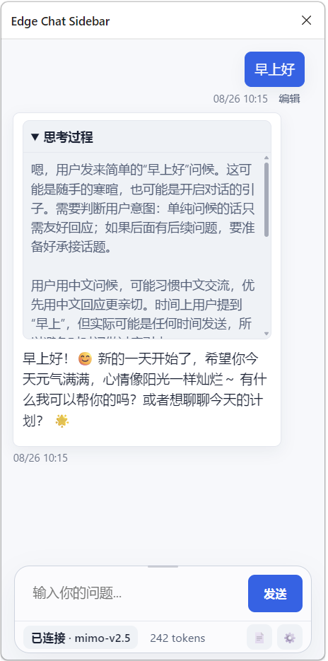

# Edge Chat Sidebar

这是一个 Microsoft Edge 侧栏扩展，可以在浏览器侧栏中调用 LLM API 进行多轮对话。它提供一个快捷的大模型对话入口，当你在网上冲浪时鬼脑突然冒出一些刁钻问题的时候，可以很方便地在侧栏中直接向模型提问。

>额，本项目理论上也可以在 Chrome 等 Chromium 内核浏览器中使用，但我只测试过 Edge，所以不保证其他浏览器的兼容性。

## 📦安装

0. 以任何你能想到的方式下载本项目源码到本地。
1. 打开 Edge，进入 `edge://extensions/`。
2. 打开“开发人员模式”。
3. 点击“加载解压缩的扩展”。
4. 选择本文件夹：`{YOUR_PATH}\EdgeChatSidebar`。
5. 点击浏览器工具栏中的扩展按钮，即可打开侧栏。

## ⚙️使用前配置

本程序默认内置了对`DeepSeek`和`小米 MiMo`的配置支持，它们都支持联网搜索；`deepseek-v4-flash-vision-exp` 和 `mimo-v2.5` 还支持图片输入。**如果想用其他的或者自己的模型，也可以自己添加自定义提供商。**

| 提供商 | 模型名称 | 百万 tokens 输出价格 | 备注 |
| --- | --- | --- | --- |
| DeepSeek | `deepseek-v4-flash` | 4.5元（高峰翻倍） | 0731正式版文本模型，支持原生联网搜索 |
| DeepSeek | `deepseek-v4-pro` | 13.5元（高峰翻倍） | 不予置评 |
| DeepSeek | `deepseek-v4-flash-vision-exp` | 4.5元（高峰翻倍） | 实验版多模态模型，支持图片输入 |
| Xiaomi | `mimo-v2.5` | 2元 | 好用，好久没更新了 |
| Xiaomi | `mimo-v2.5-pro` | 6元 | 缺一个多模态 |

>💡值得一提，小米 MiMo 还有其他产品比如语音识别和语音合成模型。本项目还没有先进到这个维度所以有想法的可以自己去探索。

然而，本程序并不是一个开箱即用的程序，因为我没有多余的钱给你们配置一个内置的免费 API Key。**你需要自己去申请 API Key，并在扩展设置中配置。**

1. 点击侧栏右下角的齿轮按钮，打开独立的“拓展选项”页面。
2. 可选填写系统提示词。
3. 如需使用 DeepSeek 或小米 MiMo 联网搜索，选择“自动判断”或“强制搜索”。此设置由两个内置提供商共用，并作用于当前选中的模型。
>DeepSeek 联网请求使用官方 Anthropic-compatible Web Search 通道；小米 MiMo 联网搜索使用前仍需在小米 MiMo 开放平台的插件管理中启用 Web Search Plugin。自动判断模式由模型决定是否搜索，强制搜索模式会要求当前模型执行搜索。
4. 在“模型 API”区域为 DeepSeek 或小米 MiMo 填写 API Key；也可以添加自定义 OpenAI 格式的 Chat Completions 提供商。
5. 保存后开始对话。

## 📖使用中说明

如果模型配置正确，左下角会显示“已连接”状态，并可以正常发送消息。

1. 点击左下角模型按钮展开列表，可手动选择 DeepSeek 或小米 MiMo 的具体模型，默认使用 DeepSeek。选择 `deepseek-v4-flash-vision-exp` 或 `mimo-v2.5` 时，可在输入框中直接粘贴 PNG、JPEG 或 WebP 图片并随消息发送。每条消息最多 4 张图片，单张不超过 5MB。
2. 消息发送后，模型会进行思考并返回回答。第一次对话完成后，本次对话将会被保存为历史对话。下方主值显示最近一次成功普通对话请求由 API 返回的精确 `total_tokens`，点击可查看总量、输出、推理、缓存、图片和搜索等可用明细。
>💡小技巧：可以在对话过程中切换不同的模型以满足你对不同智能的需求，模型切换后会继续使用当前对话上下文。
3. 可通过右下角的“历史对话”按钮管理历史对话，进行切换、压缩上下文或删除操作。
4. 新发送的消息会记录真实发送时间；开启时间戳后，它显示在消息下方。最新用户消息的时间位于编辑按钮左侧。
5. 如果你对模型的回答不满意，可以对最新发送的一条消息进行编辑并重新发送。
6. 可在“拓展选项 → 外观与消息”中调整全局字号，设置默认、纯色或自定义图片背景，并分别控制对话输入区与状态栏的不透明度和高斯模糊程度。

## 📝细节

- API Key、系统提示词、提供商配置、会话、消息时间、思考内容、usage 和图片均使用 AES-256-GCM 加密后保存在 IndexedDB，不会写入项目文件，也不会以明文保存在 `chrome.storage.local`。
- 项目默认使用的Chat Completions API 是无状态接口，所以扩展会把历史消息一起发送，以支持多轮对话。
  - 默认 DeepSeek 请求地址为 `https://api.deepseek.com/chat/completions`，请求字段以 [DeepSeek Chat Completions 文档](https://api-docs.deepseek.com/api/create-chat-completion) 为准。
  - DeepSeek 图片输入格式及限制以 [DeepSeek Vision 文档](https://api-docs.deepseek.com/guides/vision/) 为准。
  - 开启 DeepSeek 联网搜索时，请求会切换到官方 Anthropic-compatible `https://api.deepseek.com/anthropic/v1/messages`，并使用服务端 Web Search 工具；关闭后仍走原 Chat Completions 地址。
  - 默认小米 MiMo 请求地址为 `https://api.xiaomimimo.com/v1/chat/completions`，请求字段以 [MiMo OpenAI Chat Completions 兼容文档](https://mimo.mi.com/docs/zh-CN/api/chat/openai-api) 为准。
- 使用 `deepseek-v4-flash-vision-exp` 或小米 MiMo `mimo-v2.5` 粘贴图片发送时，扩展会按官方 OpenAI 兼容多模态消息格式发送：`content: [{ type: "text", text }, { type: "image_url", image_url: { url: "data:image/...;base64,..." } }]`。DeepSeek 联网搜索通道会自动转换为对应的 Anthropic 图片块。图片在磁盘上作为独立加密二进制记录保存，不保留明文 Data URL。
- 支持流式输出和 thinking mode；回答会边生成边显示，思考过程会在回答上方以折叠区展示。
- 思考过程只用于本地展示和历史记录，不会作为下一轮请求消息发送给模型 API。
- **自定义提供商只支持文本 `/chat/completions` 基础兼容模式，不开放图片、联网搜索、任意请求头、自由 JSON 模板或自定义 JavaScript**。思考模式会先尝试发送 `thinking.type=enabled`；服务端明确报告不支持时会移除该字段重试并记忆结果。流式响应可识别 `reasoning_content`、`reasoning`、`analysis` 和 `thinking` 等常见思考字段。
- 流式请求先发送 `stream_options.include_usage=true`；只有服务端在开始输出前明确报告该字段未知时，才移除该字段重试并记忆结果。
- 如果服务端成功响应但不返回 usage，状态栏显示“此模型未返回用量”，不会把字符数或本地估算冒充精确 token。

### 🔒加密、迁移与缓存

- 扩展首次运行时生成不可导出的 AES-256-GCM `CryptoKey` 并保存在 IndexedDB。每条记录使用独立随机 IV，AAD 绑定 schema 版本、记录类型和 ID；密文或元数据被篡改时会停止读取并报错。
- “拓展选项”页面中的“清理缓存”会删除历史索引未引用的孤儿会话、图片和迁移临时记录，不会删除历史列表中可见内容；删除会话、编辑截断消息或压缩上下文后也会自动执行定向清理。
- “清空全部本地数据”会删除加密数据库、已知旧存储键和动态 Origin 权限，此操作不可撤销。
- 加密能防止磁盘明文扫描和简单存储窃取，但不能抵抗已经进入扩展可信上下文执行的恶意代码。扩展代码或第三方依赖被攻破时，运行期解密数据仍可能被读取。

## ✏️计划

- [ ] 优化 UI
- [ ] 增加配置文件导入导出功能

## 开源许可

本项目的原创代码与文档采用 [MIT License](./LICENSE) 开源。你可以使用、复制、修改和分发本项目（包括商业用途），但须在副本或主要部分中保留原版权与许可声明。本项目按“原样”提供，不附带任何明示或暗示的担保。

`vendor/` 目录中的第三方代码不因本项目采用 MIT License 而被重新许可，仍分别遵循其随附的版权与许可声明。

## 第三方依赖与许可

- 本项目在 `vendor/katex/` 中内置 KaTeX `0.16.11` 的浏览器运行资源，用于在扩展侧栏中渲染 Markdown 消息里的 LaTeX 公式。
- 本项目在 `vendor/marked.min.js` 中内置 marked `13.0.3`，用于成熟的 GFM Markdown 解析。
- 本项目在 `vendor/purify.min.js` 中内置 DOMPurify `3.1.6`，用于清洗 Markdown 渲染后的 HTML。
- KaTeX 使用 MIT License；marked 本身使用 MIT License，其随附的 Markdown 组件另有 BSD 风格声明；DOMPurify 使用 Apache-2.0 或 MPL-2.0 双许可。完整声明已保留在 `vendor/katex/LICENSE`、`vendor/marked.LICENSE.md` 和 `vendor/dompurify.LICENSE`。
- 分发或修改本扩展时，请保留 `vendor/` 中第三方依赖相关版权与许可声明。
- KaTeX 项目地址：https://katex.org/
- marked 项目地址：https://marked.js.org/
- DOMPurify 项目地址：https://github.com/cure53/DOMPurify
