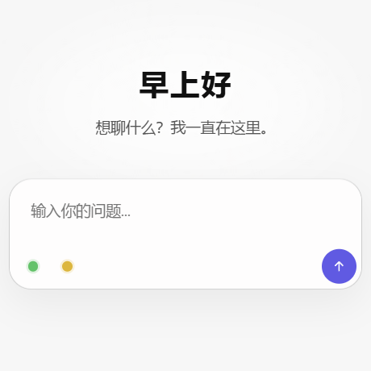

# Edge Chat Sidebar

这是一个 Microsoft Edge 侧栏扩展，可以在浏览器侧栏中调用 LLM API 进行多轮对话。它提供一个快捷的大模型对话入口，当你在网上冲浪时鬼脑突然冒出一些刁钻问题的时候，可以很方便地在侧栏中直接向模型提问。

>额，本项目理论上也可以在 Chrome 等 Chromium 内核浏览器中使用，但我只测试过 Edge，所以不保证其他浏览器的兼容性。

## 📦安装

以任何你能想到的方式下载本项目源码到本地➡️打开 Edge➡️进入 `edge://extensions/`➡️打开“开发人员模式”➡️点击“加载解压缩的扩展”➡️选择本项目文件夹。

最后，点击浏览器工具栏中的扩展按钮，即可打开侧栏。

## ⚙️一步启用

点击左下角的红色按钮，进入设置，然后进行配置添加提供商：填写名称、API 格式、Chat Completion API Base URL、API Key和模型 ID 列表。

详细配置中还可以开启图片发送支持，或自行配置请求体字段。

添加并选择提供商后，左下角的模型状态圆点会显示为绿色。

配置完成后，可以自由使用，或进入设置进行各类调整。

### 🔒加密、迁移与缓存

- 扩展首次运行时生成不可导出的 AES-256-GCM `CryptoKey` 并保存在 IndexedDB。每条记录使用独立随机 IV，AAD 绑定 schema 版本、记录类型和 ID；密文或元数据被篡改时会停止读取并报错。
- “拓展选项”页面中的“清理缓存”会删除历史索引未引用的孤儿会话、图片和迁移临时记录，不会删除历史列表中可见内容；删除会话、编辑截断消息或压缩上下文后也会自动执行定向清理。
- “清空全部本地数据”会删除加密数据库、已知旧存储键和动态 Origin 权限，此操作不可撤销。
- 加密能防止磁盘明文扫描和简单存储窃取，但不能抵抗已经进入扩展可信上下文执行的恶意代码。扩展代码或第三方依赖被攻破时，运行期解密数据仍可能被读取。

## 开源许可

本项目的原创代码与文档采用 [MIT License](./LICENSE) 开源。你可以使用、复制、修改和分发本项目（包括商业用途），但须在副本或主要部分中保留原版权与许可声明。本项目按“原样”提供，不附带任何明示或暗示的担保。

`vendor/` 目录中的第三方代码不因本项目采用 MIT License 而被重新许可，仍分别遵循其随附的版权与许可声明。

## 第三方依赖与许可

- 本项目在 `vendor/katex/` 中内置 KaTeX `0.16.11` 的浏览器运行资源，用于在扩展侧栏中渲染 Markdown 消息里的 LaTeX 公式。
- 本项目在 `vendor/marked.min.js` 中内置 marked `13.0.3`，用于成熟的 GFM Markdown 解析。
- 本项目在 `vendor/purify.min.js` 中内置 DOMPurify `3.1.6`，用于清洗 Markdown 渲染后的 HTML。
- KaTeX 使用 MIT License；marked 本身使用 MIT License，其随附的 Markdown 组件另有 BSD 风格声明；DOMPurify 使用 Apache-2.0 或 MPL-2.0 双许可。完整声明已保留在 `vendor/katex/LICENSE`、`vendor/marked.LICENSE.md` 和 `vendor/dompurify.LICENSE`。
- 分发或修改本扩展时，请保留 `vendor/` 中第三方依赖相关版权与许可声明。
- KaTeX 项目地址：https://katex.org/
- marked 项目地址：https://marked.js.org/
- DOMPurify 项目地址：https://github.com/cure53/DOMPurify
